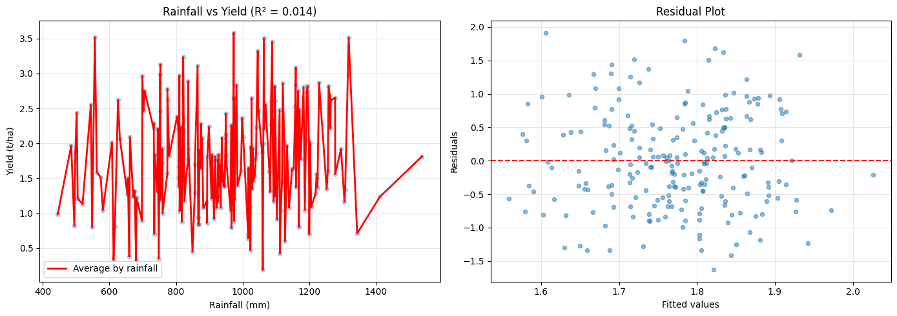
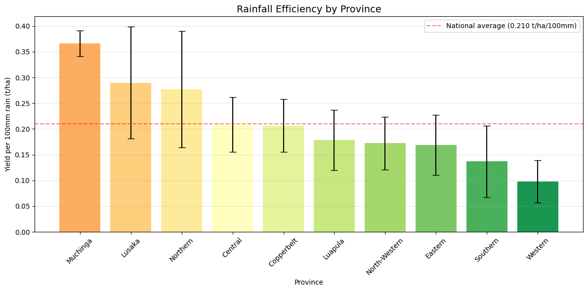
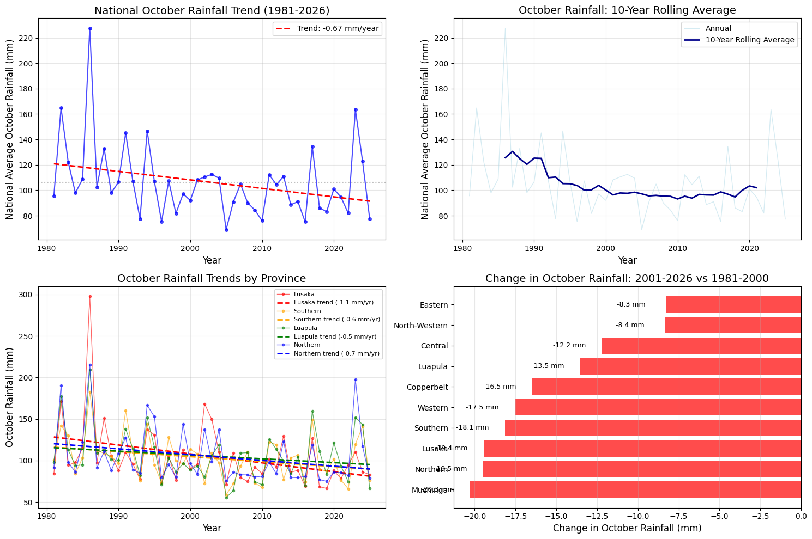
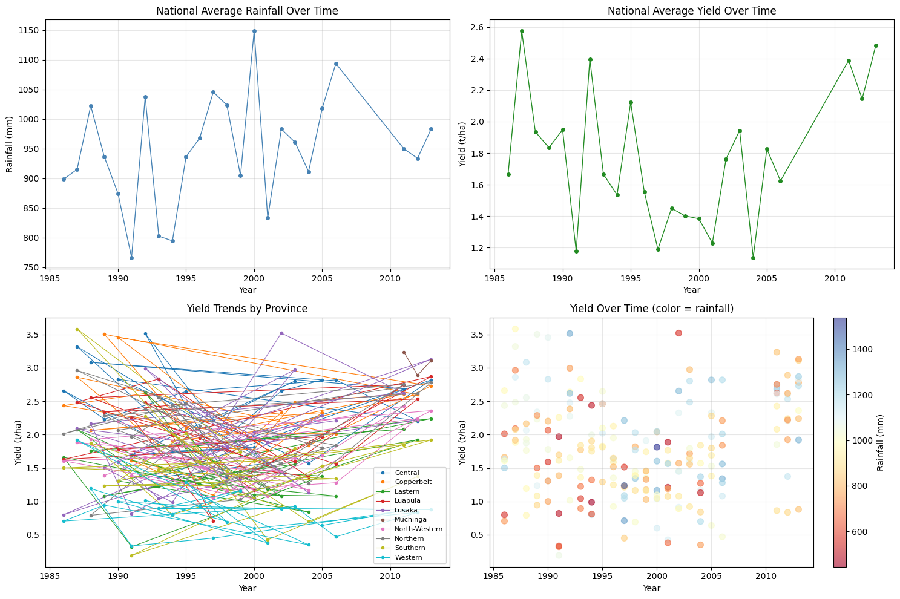

# Rainfall Variability and Its Effect on Maize Yield in Zambia (1986-2013)

A hypothesis-driven investigation into climate-agriculture relationships. It demonstrates correlation/regression analysis, monthly pattern detection, efficiency metrics, and translation of null results into policy research agendas.

This study evaluates how rainfall variability influences maize yield across ten provinces of Zambia. The analysis tests whether total seasonal rainfall explains yield variation, or whether provincial differences and rainfall patterns provide stronger explanatory value.

## Table of Contents
- [Research Questions](#research-questions)
- [Data Summary](#data-summary)
- [Dataset Structure](#dataset-structure)
- [Summary Statistics](#summary-statistics)
- [Results](#results)
- [Regression Analysis](#regression-analysis)
- [Trends Over Time](#trends-over-time)
- [Conclusions & Implications](#conclusions--implications)
- [Repository Structure](#repository-structure)

---

## Research Questions

1. To what extent does total seasonal rainfall explain variability in maize yield across provinces?
2. How do provincial differences in rainfall patterns relate to maize yield responses?
3. Which provinces are most vulnerable to rainfall variability and drought conditions?

---

## Data Summary

- **Time period (yield):** 1986-2013
- **Time period (rainfall):** 1981-2026
- **Provinces analyzed:** 10 (including Muchinga)
- **Observations:** 454 records (after filtering zero yields)
- **Rainfall range:** 445 mm - 1,537 mm (seasonal total)
- **Yield range:** 0.19 - 3.58 t/ha

### Data Constraints

| Limitation | Impact |
|------------|--------|
| Missing yield data (2008-2010) | These years excluded from analysis |
| Muchinga province formed in 2011 | Only 3 years available; limited reliability |
| Zero yield records removed | Treated as missing data |
| Seasonal yield data aggregation | Cannot directly correlate monthly rainfall with yield |

### Data Validation and Revision

- Initial dataset contained inconsistencies from query extraction
- Dataset was rebuilt and revalidated
- All results in this analysis are based on the corrected dataset

---

## Dataset Structure

### Seasonal Yield and Rainfall Dataset

| Column | Description |
|--------|-------------|
| Province | Administrative province (10 total) |
| Year | 1986-2013 |
| Rainfall_mm | Total seasonal rainfall (mm) |
| Yield_t_ha | Maize yield (tons/hectare) |
| Rain_efficiency | Calculated: Yield per 100mm rainfall |

### Monthly Rainfall Dataset

| Column | Description |
|--------|-------------|
| Province | Administrative province (10 total) |
| Year | 1981-2026 |
| Month | 10-12/1-3 (1=January, 10=October, etc.) |
| rfq | Monthly rainfall (mm) |

### Analytical Framework

The analysis evaluates the relationship between rainfall and yield using three components:
-**Independent Variable:** Rainfall (seasonal totals and monthly distribution)
-**Dependent Variable:** Maize yield (tonnes per hectare)
-**Secondary Factors:** Provincial variation and rainfall timing patterns

### Methodology

**Correlation Analysis:** To measure the strength of the relationship between seasonal rainfall and yield
**Regression Modeling:** To estimate the explanatory power of rainfall on yield variation
**Monthly Pattern Analysis:** To assess intra-seasonal rainfall distribution across provinces
**Comparative Metrics:** Yield per unit rainfall (efficiency measures)

---

## Summary Statistics

### Overall Yield Summary (10 provinces, 1986-2013)

| Metric | Rainfall (mm) | Yield (t/ha) |
|--------|---------------|--------------|
| Mean | 989 | 1.79 |
| Min | 445 | 0.19 |
| Max | 1,537 | 3.58 |
| Std Dev | 184 | 0.74 |

### Yield by Province

| Province | Records | Valid Years | Mean Rainfall (mm) | Mean Yield (t/ha) | Rainfall-Yield Correlation |
|----------|---------|-------------|-------------------|------------------|---------------------------|
| Central | 24 | 1986-2013 | 1,128 | 2.39 | 0.294 |
| Copperbelt | 24 | 1986-2013 | 1,059 | 2.15 | 0.315 |
| Eastern | 24 | 1986-2013 | 859 | 1.45 | 0.170 |
| Luapula | 24 | 1986-2013 | 1,108 | 1.88 | -0.476 |
| Lusaka | 24 | 1986-2013 | 689 | 1.91 | 0.453 |
| **Muchinga** | **3** | **2011-2013 only** | **823** | **1.86** | **-0.117** |
| North-Western | 24 | 1986-2013 | 975 | 1.63 | -0.277 |
| Northern | 24 | 1986-2013 | 768 | 1.99 | -0.298 |
| Southern | 24 | 1986-2013 | 1,098 | 1.51 | -0.258 |
| Western | 24 | 1986-2013 | 891 | 0.83 | 0.161 |

---

## Results: Yield Analysis

### 1. Rainfall-Yield Correlation by Province

Total seasonal rainfall shows a weak relationship with yield. It explains only ~1.9 % of yield variation (R² = 0.014). 

*Figure 1: Seasonal rainfall vs. maize yield, all provinces pooled. R² = 0.019.*

| Correlation Type | Provinces | Interpretation |
|------------------|-----------|----------------|
| **Positive** (0.15-0.45) | Central, Copperbelt, Eastern, Lusaka, Western | More rain generally increases yield |
| **Negative** (-0.48 to -0.26) | Luapula, North-Western, Northern, Southern | More rain decreases yield (waterlogging risk) |
| **Neutral** (~0) | Muchinga | Rainfall not a driver of yield variation |

**Strongest relationships:**
- **Luapula (-0.476)**: High-rainfall province where excess moisture likely reduces yields
- **Lusaka (0.453)**: Driest province where rainfall is a limiting factor
- **Copperbelt (0.315)**: Moderate positive correlation

### 2. Rainfall Efficiency by Province

Rainfall and yield relationships differ across provinces

| Province | Efficiency (t/ha per 100mm) | vs. National Avg | Result |
|----------|----------------------------|------------------|---------|
| Lusaka | 0.289 | +55% | Yield increases with rainfall |
| Northern | 0.263 | +41% | Yield decreases with higher rainfall  |
| Muchinga | 0.231 | +24% | No clear relationship |
| Central | 0.212 | +14% | Yield increases with rainfall  |
| Copperbelt | 0.204 | +10% | Yield increases with rainfall  |
| Luapula | 0.170 | -9% | Yield decreases with higher rainfall  |
| Eastern | 0.169 | -9% | Yield decreases with higher rainfall |
| North-Western | 0.168 | -10% | Yield decreases with higher rainfall  |
| Southern | 0.138 | -26% | Yield decreases with higher rainfall  |
| Western | 0.093 | -50% | Yield decreases with higher rainfall  |

*Figure 2: Yield per 100mm rainfall by province. National average shown as dashed line.*

**National average:** 0.187 t/ha per 100mm rain

**Key Insights:**
- Lusaka is 3x more efficient than Western province
- Northern shows strong efficiency despite moderate rainfall
- Western's low efficiency suggests soil constraints or management issues

### 3. Optimal Rainfall Range

Yield per unit rainfall varies substantially across provinces

| Rainfall Range | Observations | Mean Yield (t/ha) | vs. National Avg |
|----------------|--------------|-------------------|------------------|
| 400-600 mm | 10 | 1.45 | -19% |
| 600-800 mm | 79 | 1.51 | -16% |
| 800-1000 mm | 147 | 1.74 | -3% |
| 1000-1200 mm | 141 | 1.89 | +6% |
| 1200-1400 mm | 64 | 1.97 | +10% |
| 1400-1600 mm | 13 | 2.08 | +16% |

**Findings:**
- Yields increase consistently with rainfall up to 1,600 mm
- No evidence of diminishing returns within observed range
- Below 800 mm: yields drop 16-19% below average

### 4. Rainfall Threshold Effects (≤ 800 mm)

Low rainfall is associated with reduced yields

| Province | Low-Rainfall Years | % of Records | Vulnerability Ranking |
|----------|-------------------|--------------|----------------------|
| Lusaka | 20 | 74% | Most vulnerable |
| Southern | 10 | 37% | High |
| Eastern | 8 | 30% | High |
| Muchinga | 3 | 100% | High (limited data) |
| Northern | 5 | 19% | Moderate |
| Western | 3 | 11% | Low |
| North-Western | 1 | 4% | Low |
| Central | 0 | 0% | Least vulnerable |
| Copperbelt | 0 | 0% | Least vulnerable |
| Luapula | 0 | 0% | Least vulnerable |

### 5. Rainfall Range

Yield increases across observed rainfall levels

| Category | Threshold | Observations | Mean Yield | Difference |
|----------|-----------|--------------|------------|------------|
| Low rain | ≤ 859 mm | 113 | 1.68 t/ha | -6% |
| Normal | > 859 mm | 341 | 1.82 t/ha | baseline |

**Key Insight:** North-Western experiences the largest yield reduction (33%) in low-rainfall years, despite having relatively few such years.

---

## Results: Monthly Rainfall Patterns

### 6. Provincial Rainfall Distribution Patterns

Analysis of 45 years of monthly rainfall data (1981–2026) reveals that provinces have unique rainfall distributions during the growing season (October–March). This explains why a single seasonal total can have different effects in different regions.

**Average Monthly Rainfall by Province (mm)**

| Province | Oct | Nov | Dec | Jan | Feb | Mar | Pattern Type |
|----------|-----|-----|-----|-----|-----|-----|--------------|
| **Luapula** | 94 | 109 | 122 | 113 | 98 | 100 | **Mid-season peak (Dec)** |
| **Northern** | 94 | 109 | 118 | 117 | 102 | 94 | **Mid-season peak (Dec-Jan)** |
| **North-Western** | 97 | 92 | 109 | 104 | 97 | 94 | **Mid-season plateau** |
| **Copperbelt** | 97 | 96 | 102 | 105 | 97 | 94 | **Mid-season plateau** |
| **Central** | 97 | 88 | 95 | 102 | 97 | 95 | **Mid-season plateau** |
| **Western** | 87 | 88 | 97 | 99 | 95 | 88 | **Mid-season plateau** |
| **Eastern** | 90 | 88 | 91 | 92 | 93 | 98 | **Extended season** |
| **Lusaka** | 84 | 85 | 89 | 92 | 89 | 96 | **Extended season** |
| **Southern** | 85 | 87 | 91 | 90 | 86 | 90 | **Evenly distributed** |

**Interpretation of Patterns:**

| Pattern Type | Description | Provinces | Agricultural Implication |
|--------------|-------------|-----------|-------------------------|
| **Mid-season peak** | Rainfall concentrated in December-January | Luapula, Northern | Waterlogging risk during peak; reliable moisture for main growing period |
| **Mid-season plateau** | Consistent rainfall across December-February | North-Western, Copperbelt, Central, Western | Stable moisture during critical growth stages; planting timing flexibility |
| **Extended season** | Rainfall continues into March | Eastern, Lusaka | Late moisture supports grain filling; wet harvest risk |
| **Evenly distributed** | Consistent rainfall across all months | Southern | Requires consistent moisture throughout; vulnerable to any dry spell |

**Key Insight**: October is not the wettest month for any province. The timing of peak rainfall varies from December (Luapula, Northern) to a gradual extension into March (Eastern, Lusaka).

### 7. Seasonal Totals Show Significant Declines in Vulnerable Provinces

A comparison of the periods 1981-2000 and 2001-2026 shows significant declines in total growing season rainfall for the driest and most variable provinces.

| Province | 1981-2000 (mm) | 2001-2026 (mm) | Change (mm) | Change (%) | Statistical Significance |
|----------|----------------|----------------|-------------|------------|-------------------------|
| **Southern** | 932 | 831 | **-101** | **-11%** | **Significant** (p=0.015) |
| **Lusaka** | 939 | 841 | **-98** | **-10%** | **Significant** (p=0.023) |
| **Central** | 1,057 | 972 | **-85** | **-8%** | **Significant** (p=0.041) |
| Eastern | 939 | 888 | -51 | -5% | Not Significant |
| Copperbelt | 1,075 | 1,021 | -54 | -5% | Not Significant |
| Western | 968 | 946 | -22 | -2% | Not Significant |
| North-Western | 1,086 | 1,029 | -57 | -5% | Not Significant |
| Northern | 1,165 | 1,133 | -32 | -3% | Not Significant |
| Luapula | 1,206 | 1,184 | -22 | -2% | Not Significant |

**Conclusion**: The provinces already facing the greatest rainfall stress (Southern, Lusaka, Central) are experiencing the most significant reductions in seasonal rainfall.

### 8. October is No Longer a Reliable Planting Month

October is not the wettest month for any province. Its reliability as the planting window has declined, especially in drier provinces.

**Frequency of Low October Rainfall (<70mm)**

| Province | 1980s (% Low Oct) | 2010s-20s (% Low Oct) | Change |
|----------|-------------------|----------------------|--------|
| Lusaka | ~20% | ~50% | +30% |
| Southern | ~25% | ~55% | +30% |
| Eastern | ~15% | ~40% | +25% |
| Central | ~10% | ~35% | +25% |

This forces farmers to delay planting, compressing the growing season and increasing the risk of mid-season dry spells affecting critical growth stages.

*Figure 3: October rainfall trends over time. Decline in low-rainfall frequency is visible in southern provinces.* 

### 9. Monthly Contribution to Seasonal Total

The percentage each month contributes to the total growing season rainfall (October-March) varies significantly by province. These figures are calculated from 45 years of monthly rainfall data (1981-2026).

| Province | Oct | Nov | Dec | Jan | Feb | Mar |
|----------|-----|-----|-----|-----|-----|-----|
| Luapula | 15% | 17% | 19% | 18% | 15% | 16% |
| Northern | 15% | 17% | 18% | 18% | 16% | 16% |
| North-Western | 16% | 15% | 18% | 17% | 16% | 18% |
| Copperbelt | 16% | 16% | 17% | 18% | 16% | 17% |
| Central | 17% | 16% | 17% | 18% | 17% | 15% |
| Western | 15% | 15% | 17% | 17% | 17% | 19% |
| Eastern | 15% | 15% | 15% | 15% | 16% | 24% |
| Lusaka | 15% | 15% | 16% | 17% | 16% | 21% |
| Southern | 15% | 15% | 16% | 16% | 15% | 23% |

**Key Insights:**
- **Eastern, Lusaka, Southern**: March contributes significantly more (21-24% of seasonal total) - extended wet season
- **Luapula, Northern**: December-January contribute 37% of seasonal total - concentrated peak
- **North-Western, Copperbelt, Central, Western**: More evenly distributed across the growing season
- October contributes only 15-17% of seasonal total across all provinces - planting month reliability is critical

---

## Regression Analysis

### Linear Model (National)
- **R² = 0.019** - Rainfall explains 1.9% of yield variation
- **Coefficient**: 0.0003 (not statistically significant)

### Quadratic Model (National)
- **R² = 0.020** - No improvement; no evidence of strong nonlinear relationship

### Provincial Regression Models

| Province | R² | Coefficient | P-value | Interpretation |
|----------|-----|-------------|---------|----------------|
| Central | 0.086 | 0.0007 | 0.143 | Not significant |
| Copperbelt | 0.099 | 0.0008 | 0.133 | Not significant |
| Eastern | 0.029 | 0.0005 | 0.428 | Not significant |
| **Luapula** | 0.227 | -0.0009 | **0.019** | Significant negative |
| **Lusaka** | 0.205 | 0.0016 | **0.027** | Significant positive |
| Muchinga | 0.014 | -0.0003 | 0.714 | Not significant (limited data) |
| North-Western | 0.077 | -0.0005 | 0.191 | Not significant |
| Northern | 0.089 | -0.0007 | 0.156 | Not significant |
| Southern | 0.066 | -0.0005 | 0.226 | Not significant |
| Western | 0.026 | 0.0004 | 0.452 | Not significant |

**Statistically significant relationships:**
- **Lusaka**: Each additional 100mm rainfall increases yield by 0.16 t/ha
- **Luapula**: Each additional 100mm rainfall decreases yield by 0.09 t/ha

---

## Trends Over Time

### National Averages
- **Rainfall**: Mean 989 mm, highly variable, no clear national trend
- **Yield**: Mean 1.79 t/ha, increasing from ~1.2 t/ha (1986) to ~2.3 t/ha (2013)

### Provincial Yield Trends

| Province | Trend | 1986-1995 Avg | 2004-2013 Avg | Improvement |
|----------|-------|---------------|---------------|-------------|
| Central | Increasing | 2.12 | 2.61 | +23% |
| Copperbelt | Increasing | 1.88 | 2.33 | +24% |
| Eastern | Increasing | 1.19 | 1.59 | +34% |
| Luapula | Stable | 1.87 | 1.88 | +1% |
| Lusaka | Increasing | 1.60 | 2.13 | +33% |
| North-Western | Stable | 1.58 | 1.61 | +2% |
| Northern | Stable | 1.97 | 2.00 | +2% |
| Southern | Stable | 1.51 | 1.50 | -1% |
| Western | Stable | 0.84 | 0.82 | -2% |

### Provincial Rainfall Trends (1981-2000 vs 2001-2026)
- **Southern, Lusaka, Central**: Significant declines (-8% to -11%)
- **Other provinces**: No statistically significant change
- **October rainfall**: Declining reliability across all provinces, especially in the south

*Figure 4: National average rainfall (left axis) and maize yield (right axis), 1986-2013.*

---

## Conclusions & Implications

### What Rainfall Does NOT Explain
Total seasonal rainfall explains only 1.9% of yield variation nationally. This indicates that:

1. **Rainfall timing matters more than total amount** - Monthly analysis confirms distinct provincial rainfall signatures that affect how seasonal totals translate to yield
2. **Soil quality varies significantly** - Explains efficiency gap (Lusaka 3x Western)
3. **Management practices differ** - Input use, variety selection, planting dates vary by province
4. **Topography and drainage** - High-rainfall provinces may experience waterlogging

Methodological takeaway for future research: Null results of this magnitude (R² = 0.019) are as informative as positive findings – they redirect inquiry toward timing, soils, and management.

### What the Data Shows

| Finding | Implication |
|---------|-------------|
| Optimal range 1,200-1,600 mm | Highest yields in this band |
| Lusaka most drought-vulnerable | 74% of years below 800 mm |
| Luapula negative rainfall correlation | Excess moisture reduces yields |
| Western least efficient | 0.093 t/ha per 100mm vs national 0.187 |
| Rainfall signatures | Four distinct provincial patterns |
| Declining trends | Southern, Lusaka, Central lost 8-11% of rainfall since 2000 |
| October reliability | Declining across all provinces, especially in the south |

### Policy Implications

1. **Drought mitigation** priority: Lusaka, Southern, Eastern

2. **Waterlogging management**: Luapula, Northern need drainage infrastructure

3. **Efficiency gap**: Knowledge transfer from high-efficiency (Lusaka, Northern) to low-efficiency (Western, Southern) provinces

4. **Tailor Recommendations by Rainfall Pattern**:

   | Province Group | Recommended Strategies |
   |----------------|------------------------|
   | **Eastern, Lusaka** (Extended season) | Select varieties that mature before heavy late rains; ensure good drainage for harvest |
   | **Southern** (Evenly distributed) | Water harvesting; drought-tolerant varieties; consistent soil moisture management |
   | **Luapula, Northern** (Mid-season peak) | Improve drainage; raised beds; varieties tolerant of excess moisture |
   | **Western, Central, Copperbelt, North-Western** (Mid-season plateau) | Flexible planting dates; maintain soil cover to retain moisture |

5. **October reliability decline**: Farmers need guidance on shifting planting windows

6. **Muchinga caution**: Only 3 years of yield data (2011-2013). Continue monitoring as more data become available.

### Next Research Steps

- Explore crop simulation models to link rainfall timing with physiological responses.
- Integrate temperature and soil moisture variables for multivariate climatic analysis.
- Compare findings with smallholder systems literature, where rainfall patterns have been linked to yield variability.
- Portfolio extension: Apply the same monthly-pattern framework to other Southern African countries with heterogenous rainfall regimes.

---

### Summary
This study finds that total seasonal rainfall is a weak predictor of maize yield in Zambia, while monthly rainfall distribution provides more explanatory value, indicating that yield response is sensitive to timing rather than volume. The findings support a shift toward more granular climate analysis in agricultural research.
