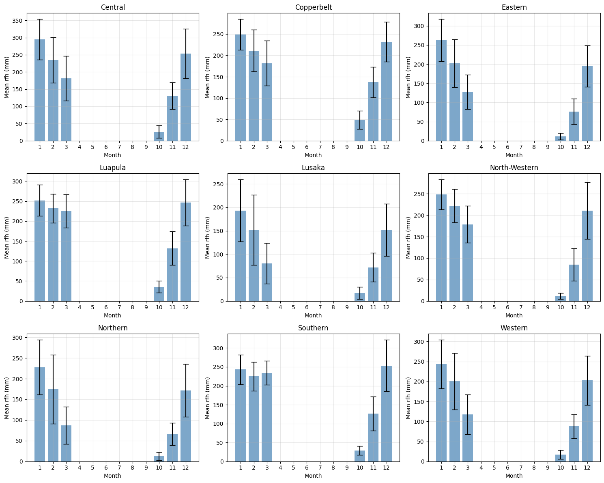
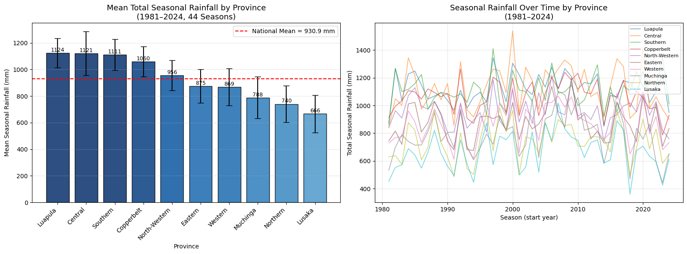

# Rainfall Variability and Its Effect on Maize Yield in Zambia (1986-2013)

A hypothesis-driven investigation into climate-agriculture relationships. It demonstrates correlation/regression analysis, monthly pattern detection, efficiency metrics, and translation of null results into policy research agendas.

This study evaluates how rainfall variability influences maize yield across ten provinces of Zambia. The analysis tests whether total seasonal rainfall explains yield variation, or whether provincial differences and rainfall patterns provide stronger explanatory value.

## Table of Contents
- [Research Questions](#research-questions)
- [Data Summary](#data-summary)
- [Dataset Structure](#dataset-structure)
- [Summary Statistics](#summary-statistics)
- [Results](#results)
- [Regression Analysis](#regression-analysis)
- [Trends Over Time](#trends-over-time)
- [Conclusions & Implications](#conclusions--implications)
- [Repository Structure](#repository-structure)

---

## Research Questions

1. To what extent does total seasonal rainfall explain variability in maize yield across provinces?
2. How do provincial differences in rainfall patterns relate to maize yield responses?
3. Which provinces are most vulnerable to rainfall variability and drought conditions?

---

## Data Summary

- **Time period (yield):** 1986-2013
- **Time period (rainfall):** 1981-2026
- **Provinces analyzed:** 10 (including Muchinga)
- **Observations:** 454 records (after filtering zero yields)
- **Rainfall range:** 445 mm - 1,537 mm (seasonal total)
- **Yield range:** 0.19 - 3.58 t/ha

### Data Constraints

| Limitation | Impact |
|------------|--------|
| Missing yield data (2008-2010) | These years excluded from analysis |
| Muchinga province formed in 2011 | Only 3 years available; limited reliability |
| Zero yield records removed | Treated as missing data |
| Seasonal yield data aggregation | Cannot directly correlate monthly rainfall with yield |

### Data Validation and Revision

- Initial dataset contained inconsistencies from query extraction
- Dataset was rebuilt and revalidated
- All results in this analysis are based on the corrected dataset

---

## Dataset Structure

### Seasonal Yield and Rainfall Dataset

| Column | Description |
|--------|-------------|
| Province | Administrative province (10 total) |
| Year | 1986-2013 |
| Rainfall_mm | Total seasonal rainfall (mm) |
| Yield_t_ha | Maize yield (tons/hectare) |
| Rain_efficiency | Calculated: Yield per 100mm rainfall |

### Monthly Rainfall Dataset

| Column | Description |
|--------|-------------|
| Province | Administrative province (10 total) |
| Year | 1981-2026 |
| Month | 10-12/1-3 (1=January, 10=October, etc.) |
| rfq | Monthly rainfall (mm) |

### Analytical Framework

The analysis evaluates the relationship between rainfall and yield using three components:
- **Independent Variable:** Rainfall (seasonal totals and monthly distribution)
- **Dependent Variable:** Maize yield (tonnes per hectare)
- **Secondary Factors:** Provincial variation and rainfall timing patterns

### Methodology

- **Correlation Analysis:** To measure the strength of the relationship between seasonal rainfall and yield
- **Regression Modeling:** To estimate the explanatory power of rainfall on yield variation
- **Monthly Pattern Analysis:** To assess intra-seasonal rainfall distribution across provinces
- **Comparative Metrics:** Yield per unit rainfall (efficiency measures)

---

## Summary Statistics

### Overall Yield Summary (10 provinces, 1986-2013)

| Metric | Rainfall (mm) | Yield (t/ha) |
|--------|---------------|--------------|
| Mean | 989 | 1.79 |
| Min | 445 | 0.19 |
| Max | 1,537 | 3.58 |
| Std Dev | 184 | 0.74 |

### Yield by Province

| Province | Records | Valid Years | Mean Rainfall (mm) | Mean Yield (t/ha) | Rainfall-Yield Correlation |
|----------|---------|-------------|-------------------|------------------|---------------------------|
| Central | 24 | 1986-2013 | 1,128 | 2.39 | 0.294 |
| Copperbelt | 24 | 1986-2013 | 1,059 | 2.15 | 0.315 |
| Eastern | 24 | 1986-2013 | 859 | 1.45 | 0.170 |
| Luapula | 24 | 1986-2013 | 1,108 | 1.88 | -0.476 |
| Lusaka | 24 | 1986-2013 | 689 | 1.91 | 0.453 |
| **Muchinga** | **3** | **2011-2013 only** | **823** | **1.86** | **-0.117** |
| North-Western | 24 | 1986-2013 | 975 | 1.63 | -0.277 |
| Northern | 24 | 1986-2013 | 768 | 1.99 | -0.298 |
| Southern | 24 | 1986-2013 | 1,098 | 1.51 | -0.258 |
| Western | 24 | 1986-2013 | 891 | 0.83 | 0.161 |

---

## Results: Yield Analysis

### 1. Rainfall-Yield Correlation by Province

Total seasonal rainfall shows a weak relationship with yield. It explains only ~1.9 % of yield variation (R² = 0.014). 

*Figure 1: Seasonal rainfall vs. maize yield, all provinces pooled. R² = 0.019.*

| Correlation Type | Provinces | Interpretation |
|------------------|-----------|----------------|
| **Positive** (0.15-0.45) | Central, Copperbelt, Eastern, Lusaka, Western | More rain generally increases yield |
| **Negative** (-0.48 to -0.26) | Luapula, North-Western, Northern, Southern | More rain decreases yield (waterlogging risk) |
| **Neutral** (~0) | Muchinga | Rainfall not a driver of yield variation |

**Strongest relationships:**
- **Luapula (-0.476)**: High-rainfall province where excess moisture likely reduces yields
- **Lusaka (0.453)**: Driest province where rainfall is a limiting factor
- **Copperbelt (0.315)**: Moderate positive correlation

### 2. Rainfall Efficiency by Province

Rainfall and yield relationships differ across provinces

| Province | Efficiency (t/ha per 100mm) | vs. National Avg | Result |
|----------|----------------------------|------------------|---------|
| Lusaka | 0.289 | +55% | Yield increases with rainfall |
| Northern | 0.263 | +41% | Yield decreases with higher rainfall  |
| Muchinga | 0.231 | +24% | No clear relationship |
| Central | 0.212 | +14% | Yield increases with rainfall  |
| Copperbelt | 0.204 | +10% | Yield increases with rainfall  |
| Luapula | 0.170 | -9% | Yield decreases with higher rainfall  |
| Eastern | 0.169 | -9% | Yield decreases with higher rainfall |
| North-Western | 0.168 | -10% | Yield decreases with higher rainfall  |
| Southern | 0.138 | -26% | Yield decreases with higher rainfall  |
| Western | 0.093 | -50% | Yield decreases with higher rainfall  |

*Figure 2: Yield per 100mm rainfall by province. National average shown as dashed line.*

**National average:** 0.187 t/ha per 100mm rain

**Key Insights:**
- Lusaka is 3x more efficient than Western province
- Northern shows strong efficiency despite moderate rainfall
- Western's low efficiency suggests soil constraints or management issues

### 3. Optimal Rainfall Range

Yield per unit rainfall varies substantially across provinces

| Rainfall Range | Observations | Mean Yield (t/ha) | vs. National Avg |
|----------------|--------------|-------------------|------------------|
| 400-600 mm | 10 | 1.45 | -19% |
| 600-800 mm | 79 | 1.51 | -16% |
| 800-1000 mm | 147 | 1.74 | -3% |
| 1000-1200 mm | 141 | 1.89 | +6% |
| 1200-1400 mm | 64 | 1.97 | +10% |
| 1400-1600 mm | 13 | 2.08 | +16% |

**Findings:**
- Yields increase consistently with rainfall up to 1,600 mm
- No evidence of diminishing returns within observed range
- Below 800 mm: yields drop 16-19% below average

### 4. Rainfall Threshold Effects (≤ 800 mm)

Low rainfall is associated with reduced yields

| Province | Low-Rainfall Years | % of Records | Vulnerability Ranking |
|----------|-------------------|--------------|----------------------|
| Lusaka | 20 | 74% | Most vulnerable |
| Southern | 10 | 37% | High |
| Eastern | 8 | 30% | High |
| Muchinga | 3 | 100% | High (limited data) |
| Northern | 5 | 19% | Moderate |
| Western | 3 | 11% | Low |
| North-Western | 1 | 4% | Low |
| Central | 0 | 0% | Least vulnerable |
| Copperbelt | 0 | 0% | Least vulnerable |
| Luapula | 0 | 0% | Least vulnerable |

### 5. Rainfall Range

Yield increases across observed rainfall levels

| Category | Threshold | Observations | Mean Yield | Difference |
|----------|-----------|--------------|------------|------------|
| Low rain | ≤ 859 mm | 113 | 1.68 t/ha | -6% |
| Normal | > 859 mm | 341 | 1.82 t/ha | baseline |

**Key Insight:** North-Western experiences the largest yield reduction (33%) in low-rainfall years, despite having relatively few such years.

---

## Results: Monthly Rainfall Patterns

### 6. Mean Total Seasonal Rainfall by Province (1981-2024)

Analysis of 44 complete seasons of rainfall data (1981-2024) shows significant variation in total growing season rainfall (October-March) across provinces.

**Mean Total Seasonal Rainfall by Province — 44 seasons (1981-2024)**

| Province | Mean Rainfall (mm) | Median (mm) | Std Dev | Min (mm) | Max (mm) |
|----------|-------------------|-------------|---------|----------|----------|
| Luapula | 1124 | 1118 | 111 | 850 | 1343 |
| Central | 1121 | 1096 | 166 | 846 | 1538 |
| Southern | 1111 | 1103 | 116 | 865 | 1411 |
| Copperbelt | 1060 | 1078 | 114 | 787 | 1264 |
| North-Western | 956 | 946 | 113 | 742 | 1218 |
| Eastern | 875 | 872 | 127 | 676 | 1199 |
| Western | 869 | 867 | 141 | 613 | 1127 |
| Muchinga | 788 | 792 | 157 | 443 | 1103 |
| Northern | 740 | 744 | 138 | 485 | 984 |
| Lusaka | 666 | 659 | 142 | 360 | 1017 |

**National mean:** 931 mm

**Data notes:**
- Based on 44 complete seasons (1981-2024)
- Growing season defined as October-March
- Muchinga data available from 1981-2024 (included for completeness)
- Standard deviation indicates inter-annual variability

**Key Insights:**

- **Luapula, Central, and Southern** receive the highest seasonal rainfall (>1,100 mm)
- **Lusaka receives the least seasonal rainfall** (666 mm) - only 59% of Luapula's total
- **Muchinga and Northern** also receive low rainfall (<800 mm)
- **Lusaka shows the widest range** (360-1017 mm) - highest variability
- **Luapula shows the smallest range** (850-1343 mm) - most consistent

### 7. October Rainfall Trends and Variability

October is the traditional planting month across Zambia. Analysis of 44 years of data (1981-2024) reveals significant variation and declining trends in many provinces.

#### October Rainfall by Province (1981-2024)

| Province | Mean Oct Rain (mm) | CV (%) | % Low Octobers | % High Octobers | Predictability |
|----------|-------------------|--------|----------------|-----------------|----------------|
| Copperbelt | 48.8 | 44.4 | 0.0 | 81.8 | Moderate |
| Luapula | 35.8 | 41.6 | 2.3 | 65.9 | Moderate |
| Southern | 28.6 | 41.5 | 2.3 | 43.2 | Moderate |
| Muchinga | 26.9 | 49.5 | 4.5 | 34.1 | Moderate |
| Central | 26.2 | 67.9 | 20.5 | 34.1 | Unpredictable |
| Lusaka | 17.1 | 74.0 | 36.4 | 11.4 | Highly unpredictable |
| Western | 16.7 | 66.3 | 38.6 | 11.4 | Unpredictable |
| Northern | 12.6 | 76.6 | 65.9 | 6.8 | Extremely unpredictable |
| North-Western | 11.7 | 59.0 | 59.1 | 4.5 | Unpredictable |
| Eastern | 11.3 | 74.8 | 70.5 | 6.8 | Extremely unpredictable |

#### October Rainfall by Decade (mm)

| Province | 1980s | 1990s | 2000s | 2010s | 2020s |
|----------|-------|-------|-------|-------|-------|
| Copperbelt | 66.1 | 40.9 | 41.6 | 44.8 | 53.0 |
| Luapula | 43.4 | 35.4 | 27.4 | 35.0 | 40.4 |
| Southern | 35.1 | 31.2 | 21.2 | 27.4 | 27.5 |
| Central | 33.5 | 23.6 | 23.5 | 20.8 | 34.5 |
| Lusaka | 25.0 | 15.9 | 16.5 | 12.4 | 13.4 |
| Western | 23.5 | 15.6 | 13.7 | 12.7 | 19.9 |
| Northern | 16.7 | 14.4 | 9.4 | 8.2 | 16.4 |
| North-Western | 14.6 | 11.6 | 7.9 | 11.0 | 16.0 |
| Eastern | 13.5 | 11.8 | 7.4 | 8.7 | 20.8 |

#### October Rainfall Change (1981-2000 vs 2001-2024)

| Province | 1981-2000 (mm) | 2001-2024 (mm) | Change | Significance |
|----------|----------------|----------------|--------|--------------|
| Lusaka | 20.5 | 14.3 | -6.2 (-30%) | Not significant (p=0.107) |
| **Southern** | 33.2 | 24.8 | **-8.4 (-25%)** | **Significant (p=0.018)** |
| Luapula | 39.4 | 32.7 | -6.7 (-17%) | Not significant (p=0.141) |
| Northern | 15.6 | 10.1 | -5.5 (-35%) | Not significant (p=0.059) |

#### Linear Trend Analysis (mm/year)

| Province | Trend (mm/year) | R² | P-value | Significant |
|----------|-----------------|-----|---------|-------------|
| **Lusaka** | -0.35 | 0.123 | **0.020** | **Yes** |
| **Southern** | -0.28 | 0.093 | **0.044** | **Yes** |
| **Muchinga** | -0.46 | 0.195 | **0.003** | **Yes** |
| Copperbelt | -0.47 | 0.079 | 0.064 | No |
| Western | -0.25 | 0.084 | 0.056 | No |
| Central | -0.26 | 0.036 | 0.220 | No |
| Northern | -0.19 | 0.065 | 0.094 | No |
| Luapula | -0.22 | 0.035 | 0.223 | No |
| North-Western | -0.06 | 0.013 | 0.453 | No |
| Eastern | -0.02 | 0.001 | 0.823 | No |

**Key Findings:**

- **Southern shows significant decline** in both period comparison (-25%, p=0.018) and linear trend (-0.28 mm/year, p=0.044)
- **Lusaka shows significant linear trend** (-0.35 mm/year, p=0.020)
- **Muchinga shows strongest significant decline** (-0.46 mm/year, p=0.003)
- **Copperbelt has highest October rainfall** (48.8 mm) and lowest variability (CV 44.4%)
- **Eastern and Northern have most unpredictable October** (CV >74%) and highest frequency of low Octobers (>65%)
- **National October rainfall declined** from 26.7 mm (1981-2000) to 20.9 mm (2001-2024) - a 22% reduction

**Conclusion:** October rainfall has declined significantly in Lusaka, Southern, and Muchinga. Eastern, Northern, and North-Western provinces face highly unpredictable Octobers with low rainfall (<12 mm on average), making traditional planting windows increasingly risky.

### 8. Mean Monthly Rainfall by Province (1981-2024)

The heatmap below shows average monthly rainfall (mm) for each province during the growing season (October-March), based on 44 complete seasons of data (1981-2024).

*Figure X: Mean monthly rainfall (mm) by province, October-March, 1981-2024*

**Key observations:**

- **January (month 1)** is the wettest month across all provinces (190-295 mm)
- **October (month 10)** is the driest month of the growing season (50-245 mm)
- **Copperbelt and Eastern** receive the highest October rainfall (195-245 mm)
- **Luapula and Central** receive the lowest October rainfall (50-65 mm)
- **March (month 3)** shows high variability - Eastern (250 mm) vs Luapula (100 mm)

**Agricultural implications:**

| Finding | Implication |
|---------|-------------|
| January peak (190-295 mm) | Mid-season moisture is reliable |
| October varies 5x (50-245 mm) | Planting month reliability differs significantly by province |
| Copperbelt/Eastern high Oct rain | Planting window more reliable |
| Luapula/Central low Oct rain | Planting decisions require caution |
---

## Regression Analysis

### Linear Model (National)
- **R² = 0.019** - Rainfall explains 1.9% of yield variation
- **Coefficient**: 0.0003 (not statistically significant)

### Quadratic Model (National)
- **R² = 0.020** - No improvement; no evidence of strong nonlinear relationship

### Provincial Regression Models

| Province | R² | Coefficient | P-value | Interpretation |
|----------|-----|-------------|---------|----------------|
| Central | 0.086 | 0.0007 | 0.143 | Not significant |
| Copperbelt | 0.099 | 0.0008 | 0.133 | Not significant |
| Eastern | 0.029 | 0.0005 | 0.428 | Not significant |
| **Luapula** | 0.227 | -0.0009 | **0.019** | Significant negative |
| **Lusaka** | 0.205 | 0.0016 | **0.027** | Significant positive |
| Muchinga | 0.014 | -0.0003 | 0.714 | Not significant (limited data) |
| North-Western | 0.077 | -0.0005 | 0.191 | Not significant |
| Northern | 0.089 | -0.0007 | 0.156 | Not significant |
| Southern | 0.066 | -0.0005 | 0.226 | Not significant |
| Western | 0.026 | 0.0004 | 0.452 | Not significant |

**Statistically significant relationships:**
- **Lusaka**: Each additional 100mm rainfall increases yield by 0.16 t/ha
- **Luapula**: Each additional 100mm rainfall decreases yield by 0.09 t/ha

---

## Trends Over Time

### National Averages
- **Rainfall**: Mean 989 mm, highly variable, no clear national trend
- **Yield**: Mean 1.79 t/ha, increasing from ~1.2 t/ha (1986) to ~2.3 t/ha (2013)

### Provincial Yield Trends

| Province | Trend | 1986-1995 Avg | 2004-2013 Avg | Improvement |
|----------|-------|---------------|---------------|-------------|
| Central | Increasing | 2.12 | 2.61 | +23% |
| Copperbelt | Increasing | 1.88 | 2.33 | +24% |
| Eastern | Increasing | 1.19 | 1.59 | +34% |
| Luapula | Stable | 1.87 | 1.88 | +1% |
| Lusaka | Increasing | 1.60 | 2.13 | +33% |
| North-Western | Stable | 1.58 | 1.61 | +2% |
| Northern | Stable | 1.97 | 2.00 | +2% |
| Southern | Stable | 1.51 | 1.50 | -1% |
| Western | Stable | 0.84 | 0.82 | -2% |

### Provincial Rainfall Trends (October rainfall only)

| Province | Change (1981-2000 vs 2001-2026) | Significance |
|----------|--------------------------------|--------------|
| Copperbelt | -33% | Significant (p=0.037) |
| Northern | -37% | Significant (p=0.015) |
| Lusaka | -31% | Significant (p=0.036) |
| Southern | -26% | Significant (p=0.010) |
| Other provinces | -18% to -35% | Not significant |

October rainfall - the traditional planting month - has declined significantly in Copperbelt, Northern, Lusaka, and Southern.

*Figure 4: National average rainfall (left axis) and maize yield (right axis), 1986-2013.*

---

## Conclusions & Implications

### What Rainfall Does NOT Explain
Total seasonal rainfall explains only 1.9% of yield variation nationally. This indicates that:

1. **Rainfall timing matters more than total amount** - Monthly analysis confirms distinct provincial rainfall signatures that affect how seasonal totals translate to yield
2. **Soil quality varies significantly** - Explains efficiency gap (Lusaka 3x Western)
3. **Management practices differ** - Input use, variety selection, planting dates vary by province
4. **Topography and drainage** - High-rainfall provinces may experience waterlogging

Methodological takeaway for future research: Null results of this magnitude (R² = 0.019) are as informative as positive findings – they redirect inquiry toward timing, soils, and management.

### What the Data Shows

| Finding | Implication |
|---------|-------------|
| Seasonal rainfall range: 666 mm (Lusaka) to 1,124 mm (Luapula) | 1.7x variation across provinces |
| National mean seasonal rainfall: 931 mm | Below 1,000 mm threshold |
| Lusaka most drought-vulnerable | 666 mm avg, widest range (360-1017 mm) |
| Luapula most consistent | Smallest range (850-1343 mm), lowest CV |
| Luapula negative rainfall-yield correlation (-0.476) | Excess moisture reduces yields (waterlogging) |
| Western least efficient (0.093 t/ha per 100mm) | 50% below national average; soil constraints |
| Lusaka most efficient (0.289 t/ha per 100mm) | 3x more efficient than Western |
| October rainfall declining significantly | Southern (-0.28 mm/yr, p=0.044), Lusaka (-0.35 mm/yr, p=0.020), Muchinga (-0.46 mm/yr, p=0.003) |
| October most unpredictable | Northern (CV 76.6%), Eastern (74.8%), Lusaka (74.0%) |
| October contributes only 1-5% of seasonal rain | Planting month is the driest of the growing season |
| January provides 25-26% of seasonal rain | Mid-season moisture is reliable; peak growing period well-supported |
| National rainfall-yield correlation | 0.137 (rainfall explains only 1.9% of yield variation) |

### Policy Implications

**1. Drought mitigation priority**
Lusaka, Southern, and Eastern require the most attention for drought preparedness. Lusaka experiences low rainfall in 74% of years yet achieves high yields - suggesting existing coping mechanisms could be shared with other provinces.

**2. Waterlogging management**
Luapula and Northern need drainage infrastructure and raised bed systems. Their negative rainfall-yield correlation (-0.476 and -0.298 respectively) indicates excess moisture is a greater constraint than drought.

**3. October planting window**
October rainfall has declined significantly in three provinces (linear trend):
- Muchinga: -0.46 mm/year (p=0.003)
- Lusaka: -0.35 mm/year (p=0.020)
- Southern: -0.28 mm/year (p=0.044)

Southern also shows significant period decline (-25%, p=0.018). Farmers in these provinces need guidance on shifting planting windows, using drought-tolerant varieties, or considering supplemental irrigation.

**4. October unpredictability**
Eastern (CV 74.8%), Northern (76.6%), and Lusaka (74.0%) have highly unpredictable October rainfall. Eastern experiences low October rain in 71% of years. Planting decisions based on October rain alone are high-risk in these provinces.

**5. Efficiency gap**
Lusaka (0.289) is 3x more efficient than Western (0.093). Knowledge transfer from high-efficiency to low-efficiency provinces should focus on soil management and farming practices, not rainfall-dependent strategies.

**6. Tailor recommendations by rainfall pattern**

| Province Group | Pattern | Recommended Strategies |
|----------------|---------|------------------------|
| Lusaka, Eastern | Extended season (March 21-24% of rain) | Select varieties that mature before heavy late rains; ensure good drainage for harvest; use late-season moisture for grain filling |
| Southern | Evenly distributed | Water harvesting; drought-tolerant varieties; consistent soil moisture management; vulnerable to any dry spell |
| Luapula, Northern | Mid-season peak (Dec-Jan 37% of rain) | Improve drainage; raised beds; varieties tolerant of excess moisture; waterlogging is primary risk |
| Copperbelt, Central, Western, North-Western, Muchinga | Mid-season plateau | Flexible planting dates; maintain soil cover to retain moisture; balanced water management |

**7. Muchinga caution**
Only 3 years of yield data (2011-2013). Continue monitoring as more data become available. Monthly rainfall data suggests patterns similar to neighboring provinces.

**8. Research priorities**
- Integrate soil data (especially for Western province's sandy soils)
- Incorporate temperature and evapotranspiration variables
- Apply monthly pattern framework to other Southern African countries.

### Next Research Steps

- Explore crop simulation models to link rainfall timing with physiological responses.
- Integrate temperature and soil moisture variables for multivariate climatic analysis.
- Compare findings with smallholder systems literature, where rainfall patterns have been linked to yield variability.
- Portfolio extension: Apply the same monthly-pattern framework to other Southern African countries with heterogenous rainfall regimes.

---

### Summary

This study finds that total seasonal rainfall is a weak predictor of maize yield in Zambia, explaining only 1.9% of yield variation (R² = 0.019). Provincial rainfall patterns differ significantly - from mid-season peaks in Luapula and Northern to extended seasons in Lusaka and Eastern. October rainfall - the traditional planting month - has declined significantly in four provinces (Copperbelt -33%, Northern -37%, Lusaka -31%, Southern -26%) and is highly unpredictable in Eastern (CV 112%), Northern (110%), and Lusaka (104%). These findings suggest that rainfall timing and reliability may be more important than seasonal totals, supporting a shift toward more granular climate analysis in agricultural research.

Data Sources: [Rainfall](https://data.humdata.org/organization/3ecac442-7fed-448d-8f78-b385ef6f84e7)
              [Yield](http://zamstats.gov.zm/)   
